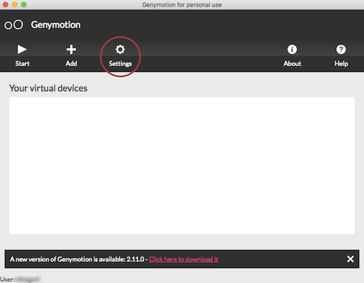
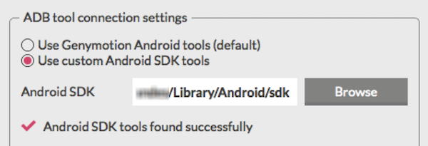

# Genymotion

Emulador do Android.

## Instalação e Configuração

Acessar o site `https://www.genymotion.com/fun-zone/` e clicar no botão `Download Genymotion Personal Edition`. O Genymotion vai pedir que você crie uma conta na plataforma, realize esse processo e depois você poderá baixar o software.

- **macOS/Windows**

  Em ambientes macOS ou Windows, basta instalar o software e abrí-lo através de seus executáveis.

- **Linux**

  Caso esteja no Linux é preciso extrair o arquivo .bin baixado do site do Genymotion em uma pasta de sua escolha e acesse-a via terminal. Acesse a pasta do arquivo extraído execute o seguinte comando:

  ```
  chmod +x genymotion-2.2.2_x64.bin
  ./genymotion-2.2.2_x64.bin
  ```

  `ATENÇÃO: Altere 2.2.2 pela versão do Genymotion que você baixou.`

  Com isso o Genymotion será instalado em seu sistema e você já pode acessá-lo a partir da pasta de instalação. Por padrão a pasta que o Genymotion é instalado é “/home/[usuario]/genymotion/“. Acesse essa pasta pelo terminal e execute o seguinte comando para abrir o Genymotion:

  ```
  ./genymotion
  ```

Se tudo ocorreu bem, aparecerá uma tela como a seguinte:



Clique no botão `Settings` e na aba `Account` faça login com a conta criada no site do GenyMotion.

Após realizado login, ainda no menu `Settings`, na aba `ADB` é preciso informar o caminho do SDK do Android.

Selecione a opção `Use Custom Android SDK Tools` no Genymotion e utilize o caminho onde foi extraído os arquivos baixados do site do Android anteriormente (Ex.: `C:\Android\Sdk` ou `~/Android/Sdk`).

Sua configuração deve ficar parecida com essa:



Agora fechando as configurações, voltando a tela principal do Genymotion podemos clicar na opção `Add` que abrirá a seguinte tela:


Escolha a opção que mais lhe agradar, mas tente utilizar sempre versões mais recentes do Android. Selecione a opção e clique em `Next`.


Depois disso ele irá te pedir um nome para o emulador, coloque o que preferir ou deixe o padrão. Depois disso clique em `Next` novamente e aguarde o download das dependências. Ao acabar o processo você terá um novo emulador na lista inicial do Genymotion:


Com dois cliques em cima do Emulador agora será possível executar o ambiente Android. Caso você receba algum erro durante esse processo recomendo executar a máquina virtual do Android diretamente pelo VirtualBox pois dessa forma você terá o log de inicialização do ambiente que conterá qualquer possível erro.

Com o emulador aberto você pode realizar o run do React Native para Android através da pasta do seu projeto.

```
react-native run-android
```

## Documentação e Instalação

Clique [aqui](https://www.genymotion.com/) para ver a documentação e fazer a instalação.

## Erro

### Your CPU is incompatible with virtualization technologies

Segundo o erro, sua CPU não permite virtualização.  

Para tentar resolver, você pode acessar a BIOS da sua máquina e procurar por alguma opção com o nome VT-x ou Virtualizartion e alterar de `disabled` para `enabled`.  

Outra opção, é verificar se o Hyper-V está habilitado e desabilitar.